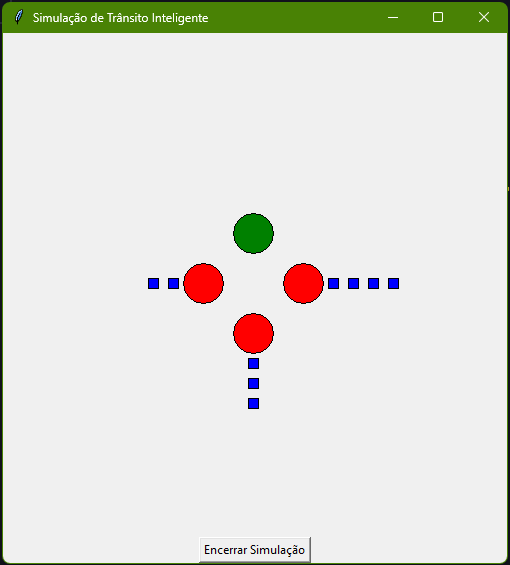

# Simulação de Trânsito Inteligente

Este projeto implementa uma simulação de controle de tráfego urbano utilizando semáforos inteligentes. A interface gráfica foi criada com a biblioteca `Tkinter` em Python, e o sistema de semáforos é gerenciado por um algoritmo que prioriza direções com mais veículos ou aquelas previamente definidas como prioritárias.

## Funcionalidades

- Semáforos que alternam entre verde, amarelo e vermelho com base no tempo e nas filas de veículos.
- Interface gráfica que exibe os semáforos e as filas de veículos esperando.
- Veículos são gerados de forma aleatória e são direcionados para as diferentes filas de semáforos.
- O sistema de controle de tráfego toma decisões com base em regras e prioridades definidas.
- Relatório de fim de simulação mostrando o status dos semáforos e o tempo de espera dos veículos.

## Estrutura do Projeto

- **`traffic_light.py`**: Define a classe `TrafficLight`, que representa um semáforo com suas operações de abrir, fechar e alternar estados.
- **`traffic_control_system.py`**: Implementa a lógica de controle dos semáforos, gerenciando seu estado e determinando quando mudar de sinal.
- **`vehicle.py`**: Define a classe `Vehicle`, representando os veículos que aguardam nos semáforos.
- **`app.py`**: Cria a interface gráfica da simulação utilizando `Tkinter`. Controla o ciclo de vida da simulação e atualiza o estado visual dos semáforos e das filas de veículos.

## Funcionamento do Sistema

- **Semáforos**: Cada semáforo pode estar nos estados de verde, amarelo ou vermelho. O tempo que um semáforo permanece verde é controlado pelo sistema, e o tempo de amarelo é fixo (3 segundos). Se o semáforo permanecer aberto por muito tempo ou tiver poucos veículos aguardando, ele fecha para que outros possam abrir.
  
- **Veículos**: Os veículos são gerados aleatoriamente e colocados na fila correspondente à sua direção (norte, sul, leste ou oeste). Cada veículo tem um tempo de espera que aumenta enquanto o semáforo está vermelho.
  
- **Sistema de Controle**: A lógica de controle decide qual semáforo abrir com base no número de veículos aguardando e nas direções prioritárias (norte e sul, por padrão). A cada ciclo, o sistema atualiza o tempo de espera dos veículos e realiza a troca de sinais quando necessário.

## Customizações

- **Direções Prioritárias**: O sistema prioriza determinadas direções (norte e sul) quando há muitos veículos aguardando. Isso pode ser alterado diretamente no arquivo `traffic_control_system.py`, no atributo `priority_directions` da classe `TrafficControlSystem`.

- **Tempos de Semáforo**: O tempo padrão que o semáforo permanece verde pode ser ajustado no arquivo `traffic_control_system.py` nos atributos `default_green_time` e `max_green_time`.

## Exemplo de Execução

Ao iniciar a simulação, uma janela será aberta mostrando os semáforos e as filas de veículos. Veículos azuis são adicionados aleatoriamente e são exibidos próximos ao semáforo correspondente. Os semáforos mudam de cor conforme o tempo passa, e os veículos são removidos quando o sinal fica verde.

 

## Relatório Final

Ao encerrar a simulação (clicando no botão "Encerrar Simulação"), um relatório será gerado no terminal mostrando:

- O status de cada semáforo (aberto ou fechado).
- O número de veículos que estavam esperando em cada direção.
- O tempo de espera de cada veículo.

Exemplo de saída:

Semáforo NORTH: Fechado Veículos esperando: 2

Veículo esperando por 8 segundos
Veículo esperando por 5 segundos
Semáforo SOUTH: Aberto Veículos esperando: 0

Semáforo EAST: Fechado Veículos esperando: 1

Veículo esperando por 4 segundos
Semáforo WEST: Fechado Veículos esperando: 0
